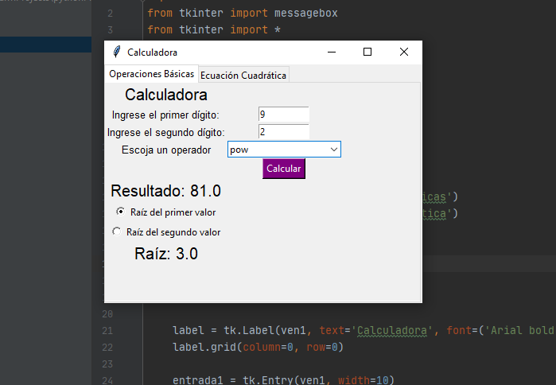
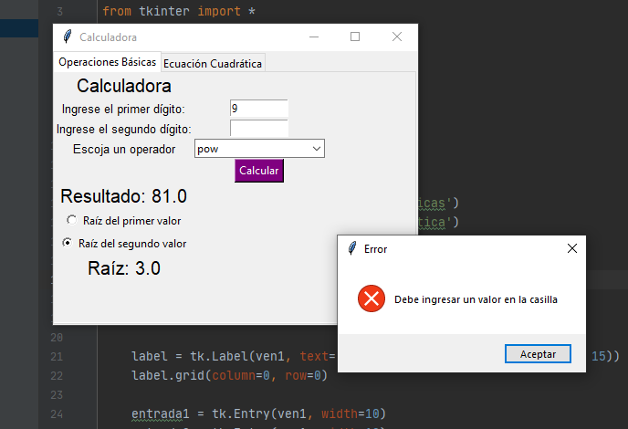

Taller 1: Mini proyecto calculadora.

Estudiante: Yuli Tatiana Infante Ruiz

Grupo 12

Información básica para ejecutar el programa: 
* Archivo .py, con librería de tkinter.

Widgets Adicionales:

1. RadioButton: Para seleccionar la raíz de alguno de los dígitos ingresados.
2. MessageBox: En caso de que ningún numero haya sido ingresado al seleccionar una raíz.
3. Notebook Widget: Pestañas para diferentes funciones de la calculadora. 

Imágenes:

  
